# Communication Diagrams - Visual Format

This document contains visual communication diagrams for all scenarios in the Attendance Management System.

---

## 1. Authentication Flow

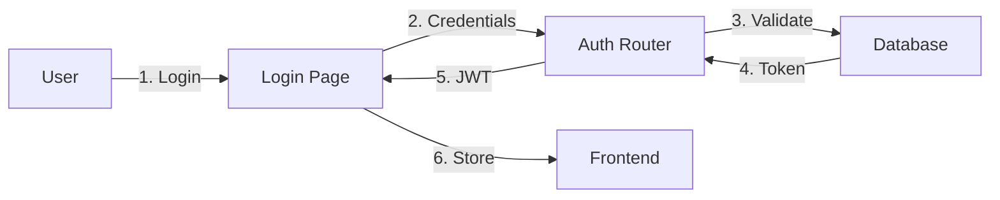

---

## 2. Admin - Add Student Flow

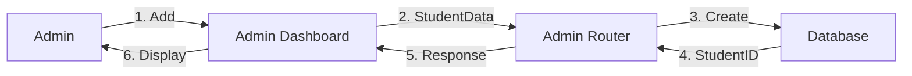

---

## 3. Admin - Upload Face Data Flow

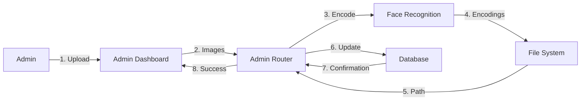

---

## 4. Faculty - Manual Attendance Flow

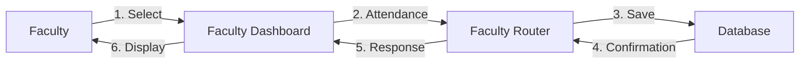

---

## 5. Faculty - Auto Attendance Flow (Face Recognition)

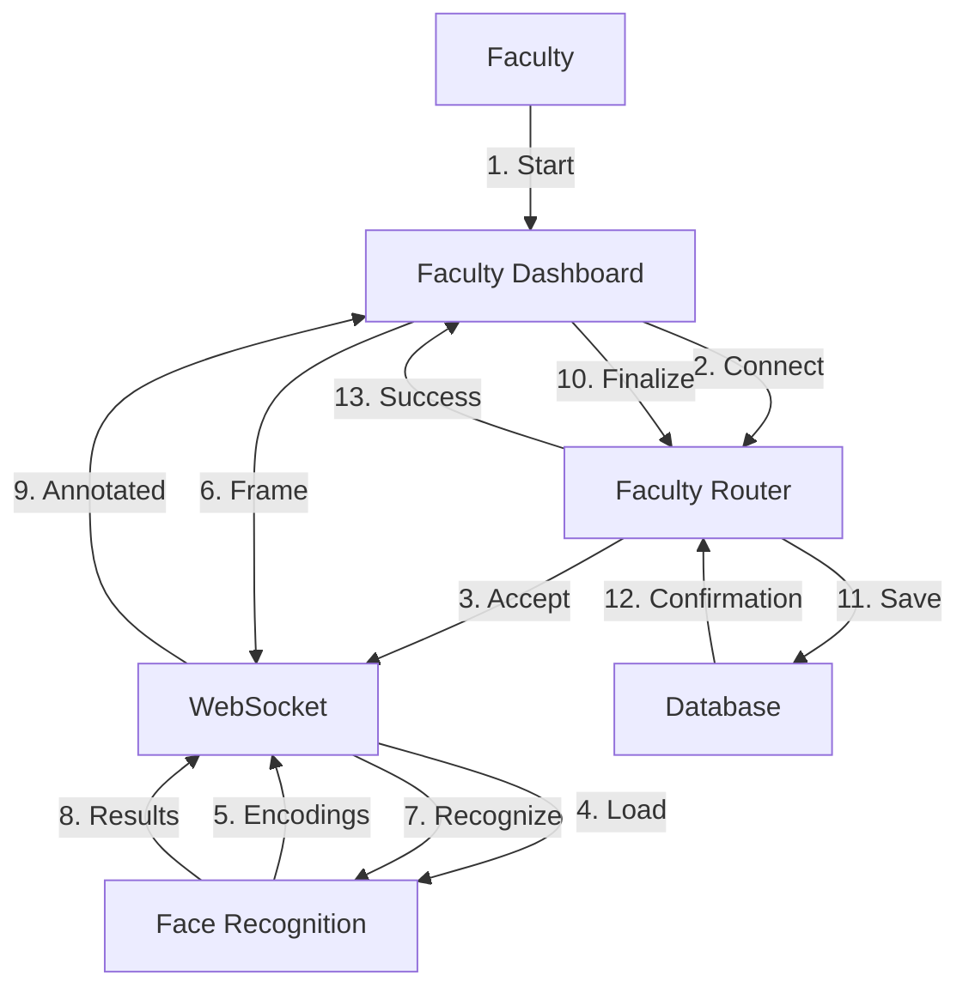

---

## 6. Student - Enroll in Class Flow

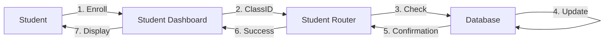

---

## 7. Student - View Attendance Flow

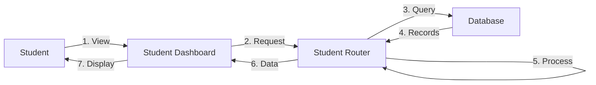

---

## 8. Faculty - Send Notification Flow

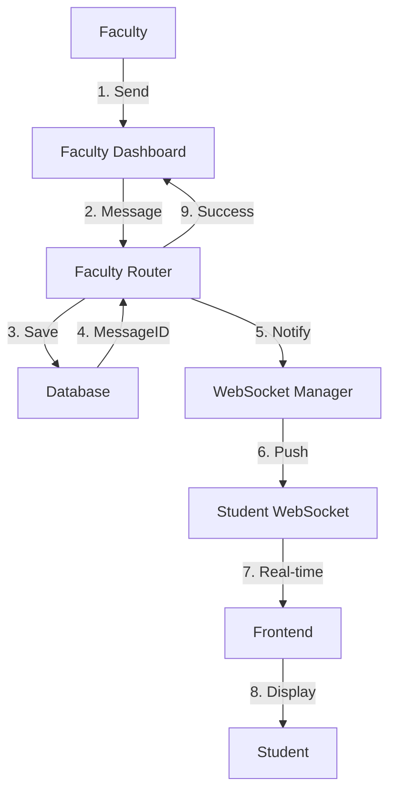

---

## 9. Admin - View Reports Flow

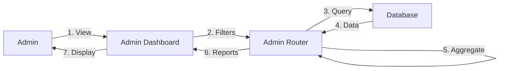

---

## 10. Student - Send Message Flow

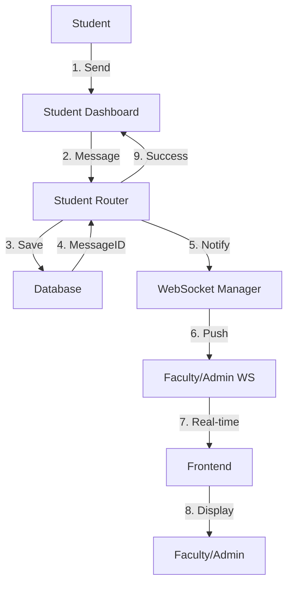

---

## 11. Admin - Create Class Flow

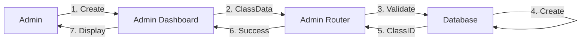

---

## 12. Student - Get QR Code Flow

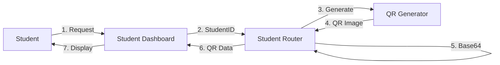

---

## Complete System Overview

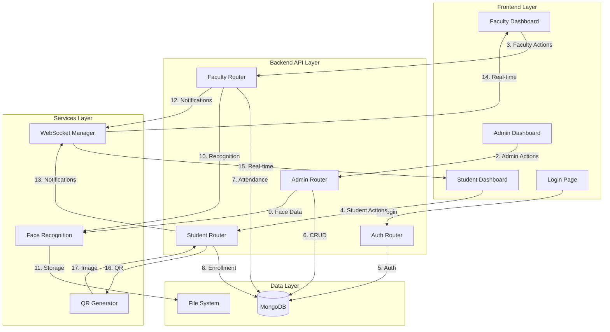

---

## Legend

- **Numbered Arrows**: Sequential communication steps
- **Boxes**: System components/modules
- **Flow Direction**: Left to right or top to bottom
- **Colors**: Different components for clarity

---

## Notes

- All flows assume authentication is validated
- Error paths are not shown for diagram clarity
- WebSocket connections are persistent
- Database operations are atomic where required

